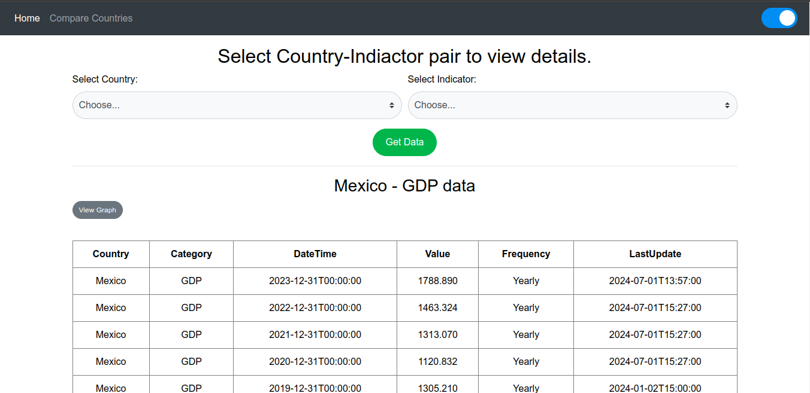
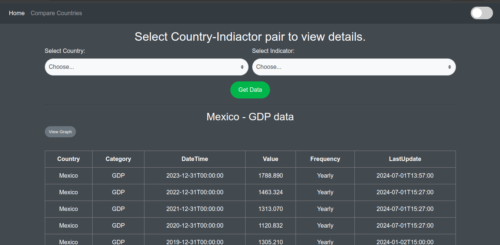
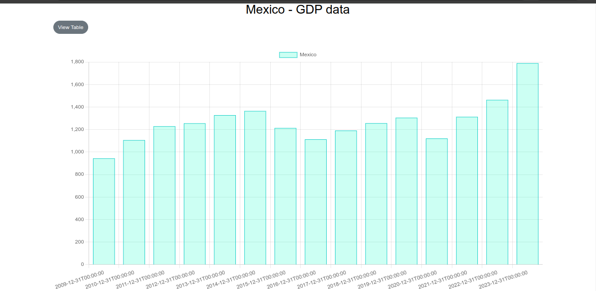
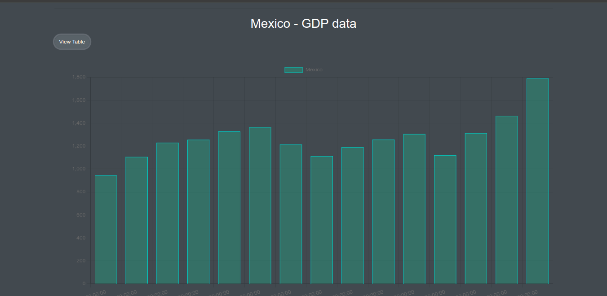
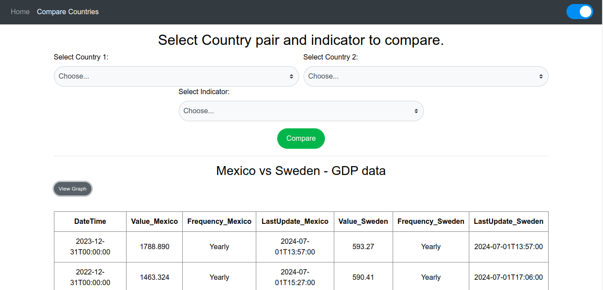
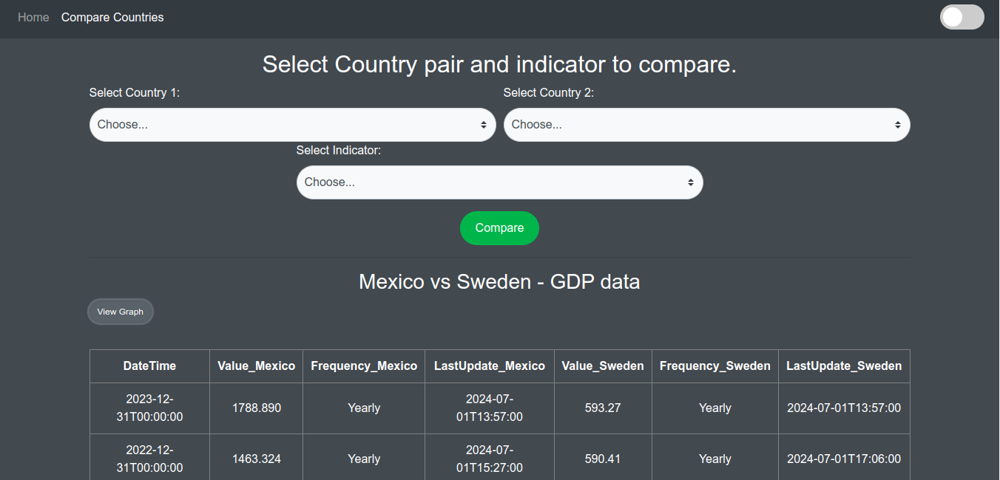
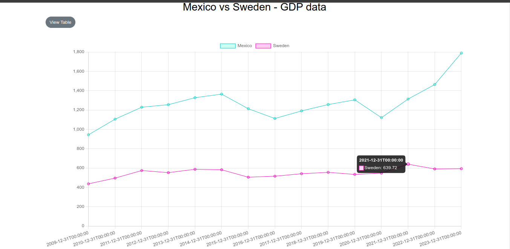
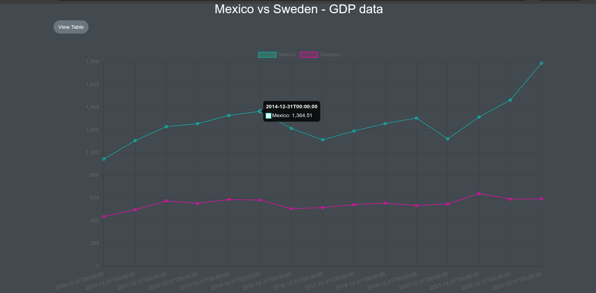

# Data Visualization and Comparison tool

This Flask web application allows users to explore country-indicator data. It features two main pages: **Home** and **Compare**. The application provides a simple interface for visualizing data in both tabular and graphical formats.

## Features

- **Home Page**
  - Displays country-indicator data in tabular form.
  - Visualizes data using a bar graph.
  
- **Compare Page**
  - Allows users to compare data between two countries based on a selected indicator.
  - Presents the comparison in both tabular form and as a line graph.

## Screenshots

### Home Page

The Home page displays the country-indicator data in a visually appealing way.

### Compare Page

The Compare page allows users to select two countries and visualize the comparison of their data.

## Note 

Other details like installation, usage, etc can be found in the instructions file inside the project folder (TE_skill_test_app).

### Introduction

The Trading Economics API provides you with direct access to 300.000 economic indicators, exchange rates, stock market indexes, government bond yields and commodity prices. Providing several request methods to query our databases, with samples available in different programming languages, it is the best way to export data in XML, CSV or JSON format. The API can be used to feed a custom developed application, a public website or just off-the-shelf software like Microsoft Excel.

